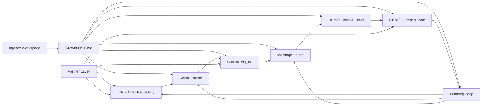
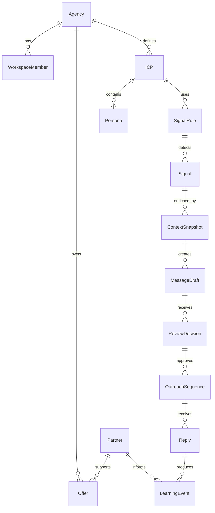
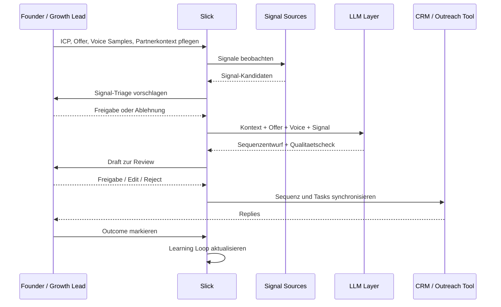

# Slick Architecture Sketch

## Basis

Diese Skizze basiert auf dem Agency Growth Playbook aus Tolaria und dem dort dokumentierten Slick-Verstaendnis. Die Loesung soll keinen generischen Outreach-Automaten bauen, sondern ein Growth-Operating-System fuer CRO- und Performance-Agenturen mit 5 bis 25 Mitarbeitenden.

## Annahmen

- Slick unterstuetzt Agenturgruender und spaetere Sales-/Growth-Rollen beim Aufbau eines wiederholbaren Neugeschaeftsmotors.
- Der Kernnutzen liegt in Spezifitaet: ICP, Offer, Signale, Kontext, Voice und Sequenzen muessen als wiederverwendbare Artefakte gepflegt werden.
- Menschen bleiben an kritischen Stellen im Loop: Signal-Triage, Message-Review und Reply-Handling.
- Das erste Produkt sollte lean starten und externe Tools integrieren, statt CRM, Outreach, Enrichment und Workflow-Automation komplett selbst zu bauen.

## Systemgrenzen

Slick ist zunaechst der Steuerungs- und Assistenzlayer ueber bestehenden Tools:

- Quellen: LinkedIn, Sales Navigator, Jobboards, Funding-News, Website-/Tech-Stack-Signale, Partnerdaten, CRM.
- Enrichment: BuiltWith, Apollo, Clay oder vergleichbare Anbieter.
- Workflow: n8n oder interner Job-Orchestrator.
- Outreach/CRM: Smartlead, HubSpot, Pipedrive oder aehnliche Systeme.
- AI: LLM-basierte Analyse, Strukturierung, Drafting und Qualitaetspruefung.

## Zielarchitektur

## Hauptmodule

### 1. Agency Workspace

Mandantenfaehiger Arbeitsraum pro Agentur. Haelt Agenturprofil, Teamrollen, Integrationen, bevorzugte Tools, aktive Offers und aktuelle 90-Tage-Ziele.

### 2. Growth OS Core

Der zentrale Applikationskern. Er orchestriert Workflows, Berechtigungen, Artefakte, Statusuebergaenge und Audit-Historie. Er entscheidet nicht autonom ueber Versand, sondern fuehrt Arbeit bis zu menschlichen Freigabepunkten.

### 3. ICP & Offer Repository

Strukturierte Ablage fuer:

- ICP-Satz und Segment-Cluster
- Personas: Champion, Economic Buyer, Technical Validator
- Productized Offers: Done-for-you, Done-with-you, Enable
- Preise, Scope, Outcomes und Proof Points
- Partnerpositionierung, zum Beispiel Varify als Offer- und GTM-Hebel

Dieses Modul ist die Quelle fuer alle spaeteren Signal-, Kontext- und Message-Entscheidungen.

### 4. Signal Engine

Sammelt und bewertet externe Signale. Beispiele:

- Tier 1: CRO-Jobposting, Funding, Migration, neuer CMO, Tooling-Wechsel
- Tier 2: neues Analytics-/Testing-Tool, Peak-Season-Vorbereitung, Traffic-Wachstum
- Tier 3: LinkedIn-Aktivitaet, Awards, Netzwerknaehe

Ausgabe ist kein fertiger Lead, sondern ein strukturierter Signal Record mit Quelle, Aktualitaet, Relevanz, ICP-Match und empfohlener Persona.

### 5. Context Engine

Reichert freigegebene Signale an:

- Unternehmenskontext
- Personen- und Rolleninformationen
- Tech Stack
- CRM-Historie
- relevante Offer-Stufe
- Partnerbezug
- moegliche Bridge zwischen Signal und Offer

Die Context Engine bereitet die Grundlage fuer spezifische, nicht generische Nachrichten.

### 6. Message Studio

Erstellt signalbasierte Sequenzentwuerfe nach Playbook-Struktur:

- Anchor
- Bridge
- Specific Value Hint
- Soft Specific CTA
- knappe Signatur

Das Studio nutzt Voice Samples des Senders und prueft aktiv gegen generische AI-Sales-Muster wie austauschbare Rollen-Pains, substanzloses Lob oder Follow-up-Floskeln.

### 7. Human Review Gates

Explizite Freigabepunkte:

- Signal-Triage: lohnt sich dieser Anlass?
- Draft-Review: ist die Nachricht spezifisch, korrekt und im Stil des Senders?
- Dispatch Approval: darf die Sequenz ins Outreach-Tool?
- Reply Handling: ab der ersten Antwort uebernimmt der Mensch.

Diese Gates sind Produktbestandteil, kein Compliance-Anhaengsel.

### 8. CRM / Outreach Sync

Synchronisiert freigegebene Daten mit bestehenden Tools:

- Leads, Accounts und Kontakte
- Sequenzen und Tasks
- Deal-Stage oder Opportunity-Erstellung
- Aktivitaeten und Replies

Slick sollte in der ersten Version nicht versuchen, CRM oder Outreach-Tool zu ersetzen.

### 9. Partner Layer

Modelliert strategische Software-Partnerschaften als GTM-Hebel:

- Partnerprofile
- Konditionen und Partnerlevel
- gemeinsame Proof Points
- Co-Selling-Material
- Lead-Sharing-Status
- Produktfeedback und Roadmap-Inputs

Varify ist im Playbook der Referenzpartner, die Architektur sollte aber weitere Partner zulassen.

### 10. Learning Loop

Fuehrt Ergebnisse zurueck in das System:

- Reply Rates nach Signal-Tier
- Meeting Rates nach Persona
- Stage Conversion
- Sales Cycle
- Win/Loss-Muster
- Message Feedback
- Signalqualitaet

Der Learning Loop verbessert ICP, Offer, Signaltaxonomie, Sequenzen und Partnerstrategie.

## Datenmodell grob

## Kernworkflow

## MVP-Schnitt

Der erste sinnvolle Schnitt sollte nicht "alles automatisieren", sondern den Sales-Motor sichtbar machen:

1. Agency Workspace mit ICP-, Persona- und Offer-Artefakten.
2. Manuell oder halbautomatisch importierbare Signal Records.
3. Context Builder fuer einzelne Signale.
4. Message Studio mit Voice Samples und Review-Gate.
5. Export oder einfache Synchronisation zu CRM/Outreach.
6. Basis-Learning ueber Signal-Tier, Persona, Reply und Meeting Outcome.

Bewusst nicht im MVP:

- vollautomatischer Versand ohne Review
- eigenes CRM
- eigene umfangreiche Enrichment-Datenbank
- autonome Reply-Beantwortung
- komplexe Multi-Partner-Marktplatzlogik

## Architekturprinzipien

- Artefakt zuerst: ICP, Offer, Persona, Signal und Voice sind eigene Datenobjekte, keine Prompt-Texte.
- Human-in-the-loop by design: Freigaben sind Teil des Workflows.
- Integrationsfreundlich: externe Tools anbinden, nicht sofort ersetzen.
- Auditierbar: jede AI-Ableitung muss auf Signal, Kontext und Offer zurueckfuehrbar sein.
- Lernfaehig: Outcomes verbessern Regeln und Vorlagen, nicht nur Dashboards.
- Lean start: erst nach echten Lernschleifen mehr Automatisierung bauen.
- Security first: Least Privilege, Defense in Depth, Multi-Tenancy, Zero Trust, Secure by Design & Default, and Assume Breach. 

## Offene Produktfragen

- Soll Slick zuerst als Web-App, lokaler Workspace-Assistent oder n8n-naher Workflow-Layer starten?
- Welches CRM/Outreach-Tool ist fuer die erste Zielagentur gesetzt?
- Sind Signale im ersten Schritt manuell importiert, via APIs angebunden oder durch Scraping/Monitoring gesammelt?
- Welche Varify-Daten duerfen produktseitig eingebunden werden?
- Soll Slick mehrere Agenturen frueh mandantenfaehig bedienen oder zunaechst als Single-Agency-System wachsen?
