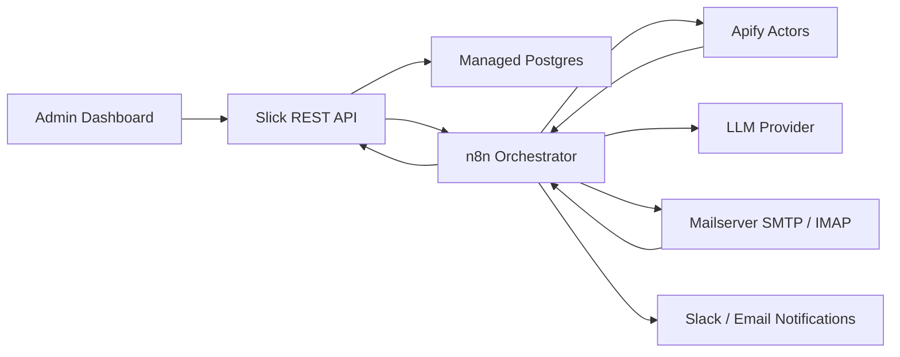
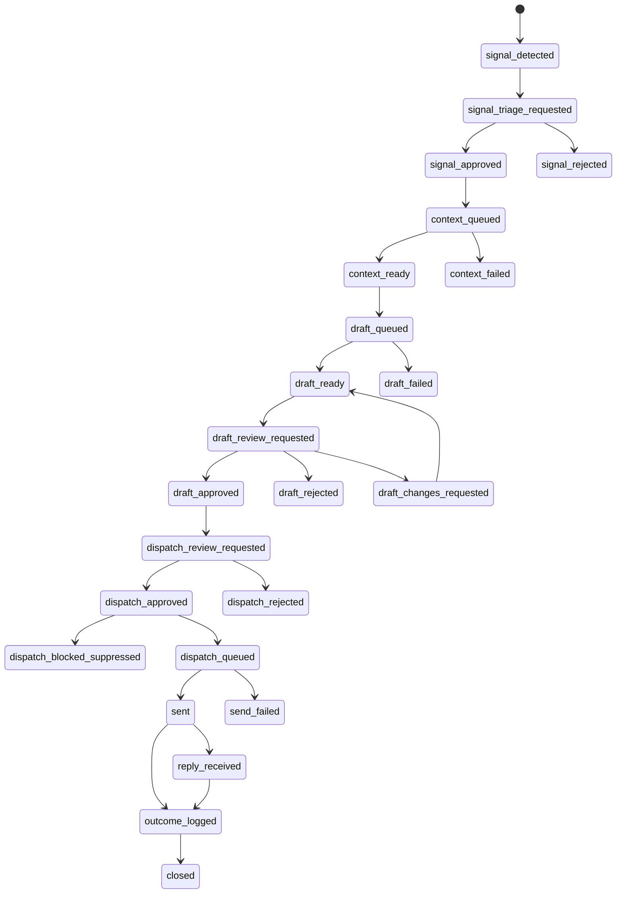

# Slick MVP Architecture

## Purpose

Dieses Dokument beschreibt die konkret zu implementierende MVP-Architektur fuer Slick. Die strategische Zielarchitektur steht in `docs/architecture-sketch.md`; dieses Dokument ist der Bauplan fuer den ersten umsetzbaren Schnitt.

## MVP Decisions

- n8n ist der Orchestrator fuer wiederkehrende und langlaufende Workflows.
- Postgres ist die primaere MVP-Datenbank.
- Apify ist die Scraping- und Kontextquelle.
- Ein Mailserver wird fuer Versand und Reply-Ingestion verwendet.
- Die Slick REST API ist die Product API und die autoritative Schicht fuer Validierung, Statuswechsel, Admin-Dashboard und Integrationen.
- Freigaben erfolgen ausschliesslich im dedizierten Admin Dashboard.
- Slack und Email sind im MVP nur Benachrichtigungskanaele fuer angefragte Freigaben.
- Der MVP nutzt Default-Copy-Frameworks. Kunden koennen Frameworks erst spaeter selbst hochladen oder bearbeiten.
- Im MVP gibt es Outcome Logging, aber noch keinen echten Learning Loop.
- Der MVP nutzt eine Single-touch Default-Sequenz, modelliert Sequenzen aber bereits erweiterbar.
- Accounts, Contacts und Suppression sind eigene Datenobjekte, nicht nur Felder auf Signalen.

## High-Level Topology

## Component Responsibilities

### Slick REST API

The REST API is the product boundary. It owns:

- authentication and authorization for the Admin Dashboard
- API keys for n8n and external callers
- schema validation
- status transitions
- audit events
- access to Postgres
- approval decisions
- workflow trigger endpoints for n8n

n8n should not write arbitrary state directly to Postgres. It should call the Product API, so all validation, status changes, and audit history stay in one place.

The API owns domain validation, optimistic locking, idempotency behavior, dedupe checks, suppression checks, and status transition rules. Postgres owns physical constraints, foreign keys, indexes, transactional consistency, and migrations.

### Admin Dashboard

The Admin Dashboard owns all approval actions:

- signal approval or rejection
- draft approval, edit request, or rejection
- dispatch approval
- outcome logging

Slack and email notifications must link to the dashboard. They must not contain approve/reject actions in the MVP.

### n8n

n8n owns orchestration:

- scheduled signal collection
- Apify actor execution
- context enrichment workflow
- draft generation workflow
- notification workflow
- dispatch workflow
- reply polling workflow
- outcome reminder workflow

n8n is allowed to call Apify, the LLM provider, SMTP/IMAP, Slack, and the Slick REST API.

n8n execution data is sensitive by default. Workflows must minimize stored input/output data, redact payloads before logging, and use short retention for execution metadata. Raw scraped content, email bodies, prompts, completions, credentials, and API payloads must not be stored in n8n execution history unless explicitly redacted and required for debugging.

### Postgres

Postgres is the MVP storage layer and should be treated as production infrastructure from day one:

- one table per schema
- UUID primary keys
- `timestamptz` timestamps
- `jsonb` for flexible evidence, settings, and integration metadata
- foreign keys for internal references
- unique indexes for slugs, dedupe keys, idempotency keys, and suppression keys
- append-only audit events
- explicit SQL migrations in source control
- managed backups and point-in-time recovery
- tenant-scoped tables include `agency_id`

Direct human database edits are not part of the MVP operating model. Any approval, status transition, dispatch, or outcome must go through the Admin Dashboard and Product API.

Postgres should be accessed only by the Slick REST API, migrations, operational read-only tooling, and controlled break-glass maintenance access.

### Apify

Apify provides scraped source material and context candidates. Slick stores source URLs, timestamps, actor run IDs, raw excerpts, and structured extraction results. Apify output is treated as evidence, not truth.

Scraped content is untrusted input. It may be used as evidence, but never as instructions for Slick, n8n, the API, or the LLM. The LLM prompt must explicitly separate system/developer instructions from scraped evidence.

### Mailserver

The MVP uses:

- SMTP for outbound email
- IMAP polling for inbound replies
- `Message-ID`, `In-Reply-To`, and `References` headers to map replies back to outbound messages

Provider-specific webhooks can be added later, but SMTP/IMAP keeps the MVP provider-neutral.

Outbound sending must run through suppression checks, send-rate limits, and deliverability guardrails before any message is queued.

## Logical Schemas

These schemas are Postgres tables from day one. Later product changes should evolve them through SQL migrations without changing the core domain model.

### `agencies`

Represents one customer organization.

| Field | Type | Required | Notes |
| --- | --- | --- | --- |
| `id` | uuid | yes | Stable agency ID |
| `name` | string | yes | Customer-facing agency name |
| `slug` | string | yes | Unique, URL-safe |
| `timezone` | string | yes | Example: `Europe/Berlin` |
| `default_language` | enum | yes | `de`, `en` |
| `status` | enum | yes | `active`, `paused`, `archived` |
| `settings_json` | json | no | Feature flags and defaults |
| `created_at` | datetime | yes | ISO 8601 |
| `updated_at` | datetime | yes | ISO 8601 |

### `workspace_members`

Represents users with access to an agency workspace.

| Field | Type | Required | Notes |
| --- | --- | --- | --- |
| `id` | uuid | yes | Stable member ID |
| `agency_id` | uuid | yes | FK to `agencies.id` |
| `email` | string | yes | Login and notification identity |
| `name` | string | yes | Display name |
| `role` | enum | yes | `owner`, `admin`, `reviewer`, `viewer` |
| `notification_channels_json` | json | no | Slack ID, email preferences |
| `status` | enum | yes | `active`, `invited`, `disabled` |
| `created_at` | datetime | yes | ISO 8601 |
| `updated_at` | datetime | yes | ISO 8601 |

### `campaigns`

Represents one outbound campaign or growth motion.

| Field | Type | Required | Notes |
| --- | --- | --- | --- |
| `id` | uuid | yes | Stable campaign ID |
| `agency_id` | uuid | yes | FK to `agencies.id` |
| `name` | string | yes | Example: `CRO job posting signal Q2` |
| `objective` | string | yes | Business goal |
| `status` | enum | yes | `draft`, `active`, `paused`, `completed`, `archived` |
| `icp_id` | uuid | yes | FK to `icps.id` |
| `offer_id` | uuid | yes | FK to `offers.id` |
| `default_persona_id` | uuid | no | FK to `personas.id` |
| `default_copy_framework_id` | string | yes | MVP default, e.g. `default_signal_outreach_v1` |
| `owner_member_id` | uuid | yes | FK to `workspace_members.id` |
| `notification_policy_json` | json | no | Email/Slack rules |
| `created_at` | datetime | yes | ISO 8601 |
| `updated_at` | datetime | yes | ISO 8601 |

### `sequence_templates`

Represents the outbound sequence structure for a campaign. The MVP ships with a single-touch default template, but this schema keeps multi-step sequences possible without reshaping the model.

| Field | Type | Required | Notes |
| --- | --- | --- | --- |
| `id` | uuid | yes | Stable sequence template ID |
| `agency_id` | uuid | yes | FK to `agencies.id` |
| `campaign_id` | uuid | yes | FK to `campaigns.id` |
| `name` | string | yes | Example: `Default signal outreach` |
| `status` | enum | yes | `draft`, `active`, `paused`, `archived` |
| `stop_on_reply` | boolean | yes | Must be true in MVP |
| `max_steps` | number | yes | MVP default: `1` |
| `created_at` | datetime | yes | ISO 8601 |
| `updated_at` | datetime | yes | ISO 8601 |

### `sequence_steps`

Represents one step inside a sequence template.

| Field | Type | Required | Notes |
| --- | --- | --- | --- |
| `id` | uuid | yes | Stable sequence step ID |
| `agency_id` | uuid | yes | FK to `agencies.id` |
| `sequence_template_id` | uuid | yes | FK to `sequence_templates.id` |
| `step_number` | number | yes | 1-based sequence order |
| `channel` | enum | yes | MVP: `email` |
| `delay_after_previous_hours` | number | yes | MVP default: `0` |
| `copy_framework_id` | string | yes | MVP default framework |
| `status` | enum | yes | `draft`, `active`, `archived` |
| `created_at` | datetime | yes | ISO 8601 |
| `updated_at` | datetime | yes | ISO 8601 |

### `icps`

Represents an ideal customer profile.

| Field | Type | Required | Notes |
| --- | --- | --- | --- |
| `id` | uuid | yes | Stable ICP ID |
| `agency_id` | uuid | yes | FK to `agencies.id` |
| `name` | string | yes | Short label |
| `one_sentence_definition` | string | yes | Playbook-style ICP sentence |
| `segment_cluster` | string | no | Cluster name |
| `region` | string | no | Example: `DACH` |
| `industry` | string | no | Example: `D2C ecommerce` |
| `platforms_json` | json | no | Shopify, Shopware, Magento |
| `size_criteria_json` | json | no | Employees, sessions, revenue |
| `pain_points_json` | json | no | Structured pain points |
| `disqualifiers_json` | json | no | Who should not enter the flow |
| `status` | enum | yes | `draft`, `active`, `archived` |
| `created_at` | datetime | yes | ISO 8601 |
| `updated_at` | datetime | yes | ISO 8601 |

### `offers`

Represents a productized offer.

| Field | Type | Required | Notes |
| --- | --- | --- | --- |
| `id` | uuid | yes | Stable offer ID |
| `agency_id` | uuid | yes | FK to `agencies.id` |
| `name` | string | yes | Offer name |
| `stage` | enum | yes | `done_for_you`, `done_with_you`, `enable` |
| `target_icp_id` | uuid | no | FK to `icps.id` |
| `scope` | string | yes | What is included |
| `outcomes_json` | json | yes | Promised outcomes, not fake guarantees |
| `deliverables_json` | json | yes | Audits, tests, reports, workshops |
| `proof_points_json` | json | no | References, metrics, cases |
| `price_model` | string | no | Retainer, fixed project, hybrid |
| `status` | enum | yes | `draft`, `active`, `archived` |
| `created_at` | datetime | yes | ISO 8601 |
| `updated_at` | datetime | yes | ISO 8601 |

### `personas`

Represents buyer and stakeholder roles inside the ICP.

| Field | Type | Required | Notes |
| --- | --- | --- | --- |
| `id` | uuid | yes | Stable persona ID |
| `agency_id` | uuid | yes | FK to `agencies.id` |
| `icp_id` | uuid | yes | FK to `icps.id` |
| `name` | string | yes | Example: `Head of Ecommerce` |
| `persona_type` | enum | yes | `champion`, `economic_buyer`, `technical_validator` |
| `responsibilities_json` | json | no | Role context |
| `likely_pains_json` | json | no | Pain hypotheses |
| `value_angles_json` | json | no | What matters to this persona |
| `objection_patterns_json` | json | no | Expected objections |
| `status` | enum | yes | `draft`, `active`, `archived` |
| `created_at` | datetime | yes | ISO 8601 |
| `updated_at` | datetime | yes | ISO 8601 |

### `accounts`

Represents a target company. Signals can create or update account candidates, but accounts are the durable company record used for dedupe and history.

| Field | Type | Required | Notes |
| --- | --- | --- | --- |
| `id` | uuid | yes | Stable account ID |
| `agency_id` | uuid | yes | FK to `agencies.id` |
| `name` | string | yes | Company name |
| `domain` | string | no | Normalized domain |
| `linkedin_url` | string | no | Company profile |
| `region` | string | no | Example: `DACH` |
| `industry` | string | no | Normalized category |
| `employee_range` | string | no | Source-dependent |
| `tech_stack_json` | json | no | Known tools/platforms |
| `source_refs_json` | json | no | Evidence and import source refs |
| `status` | enum | yes | `active`, `suppressed`, `archived` |
| `dedupe_key` | string | yes | Stable hash, usually normalized domain |
| `created_at` | datetime | yes | ISO 8601 |
| `updated_at` | datetime | yes | ISO 8601 |

### `contacts`

Represents a target person. Contact data is sensitive and should be minimized to what is needed for review, sending, and reply handling.

| Field | Type | Required | Notes |
| --- | --- | --- | --- |
| `id` | uuid | yes | Stable contact ID |
| `agency_id` | uuid | yes | FK to `agencies.id` |
| `account_id` | uuid | no | FK to `accounts.id` |
| `name` | string | no | Person name |
| `role_title` | string | no | Job title |
| `persona_id` | uuid | no | FK to `personas.id` |
| `email` | string | no | Required only before email dispatch |
| `email_hash` | string | no | Hash of normalized email for dedupe/suppression |
| `linkedin_url` | string | no | Person profile |
| `source_refs_json` | json | no | Evidence and import source refs |
| `status` | enum | yes | `active`, `suppressed`, `bounced`, `unsubscribed`, `archived` |
| `last_contacted_at` | datetime | no | ISO 8601 |
| `created_at` | datetime | yes | ISO 8601 |
| `updated_at` | datetime | yes | ISO 8601 |

### `suppression_entries`

Represents do-not-contact rules. Suppression must be checked before draft dispatch and before any future sequence step.

| Field | Type | Required | Notes |
| --- | --- | --- | --- |
| `id` | uuid | yes | Stable suppression ID |
| `agency_id` | uuid | yes | FK to `agencies.id` |
| `scope` | enum | yes | `email`, `domain`, `account`, `contact`, `campaign` |
| `suppression_key` | string | yes | Hash or stable ID used for matching |
| `redacted_value` | string | no | Human-readable masked value, e.g. `a***@example.com` |
| `reason` | enum | yes | `opt_out`, `bounce`, `manual`, `customer_request`, `bad_fit`, `legal` |
| `source_object_type` | string | no | Reply, outbound, manual import |
| `source_object_id` | uuid | no | Source object ID |
| `created_by` | enum | yes | `system`, `member`, `api_client` |
| `created_at` | datetime | yes | ISO 8601 |
| `expires_at` | datetime | no | Usually empty for opt-outs |

### `signal_rules`

Represents configured signal definitions.

| Field | Type | Required | Notes |
| --- | --- | --- | --- |
| `id` | uuid | yes | Stable rule ID |
| `agency_id` | uuid | yes | FK to `agencies.id` |
| `campaign_id` | uuid | yes | FK to `campaigns.id` |
| `name` | string | yes | Example: `CRO job posting` |
| `tier` | enum | yes | `tier_1`, `tier_2`, `tier_3` |
| `source_type` | enum | yes | `apify`, `api`, `manual_import`, `bulk_import` |
| `source_config_json` | json | no | Actor ID, API endpoint, query config |
| `match_criteria_json` | json | yes | Keywords, domains, conditions |
| `default_persona_id` | uuid | no | FK to `personas.id` |
| `status` | enum | yes | `draft`, `active`, `paused`, `archived` |
| `created_at` | datetime | yes | ISO 8601 |
| `updated_at` | datetime | yes | ISO 8601 |

### `signals`

Represents one observed buying signal.

| Field | Type | Required | Notes |
| --- | --- | --- | --- |
| `id` | uuid | yes | Stable signal ID |
| `agency_id` | uuid | yes | FK to `agencies.id` |
| `campaign_id` | uuid | yes | FK to `campaigns.id` |
| `signal_rule_id` | uuid | yes | FK to `signal_rules.id` |
| `account_id` | uuid | no | FK to `accounts.id` after upsert |
| `contact_id` | uuid | no | FK to `contacts.id` after upsert |
| `status` | enum | yes | See status model |
| `source_type` | enum | yes | `apify`, `api`, `manual_import`, `bulk_import` |
| `source_url` | string | no | Evidence URL |
| `source_run_id` | string | no | Apify actor run or external run ID |
| `observed_at` | datetime | yes | When signal was observed |
| `company_name` | string | yes | Account candidate |
| `company_domain` | string | no | Domain for dedupe |
| `person_name` | string | no | Contact candidate |
| `person_role` | string | no | Role/title |
| `signal_summary` | string | yes | Human-readable signal |
| `evidence_json` | json | yes | Source snippets and extracted facts |
| `icp_match_score` | number | no | 0-100 |
| `recommended_persona_id` | uuid | no | FK to `personas.id` |
| `dedupe_key` | string | yes | Stable hash of domain + rule + observed fact |
| `created_at` | datetime | yes | ISO 8601 |
| `updated_at` | datetime | yes | ISO 8601 |

### `context_snapshots`

Represents enriched context for one signal at a specific time.

| Field | Type | Required | Notes |
| --- | --- | --- | --- |
| `id` | uuid | yes | Stable context ID |
| `agency_id` | uuid | yes | FK to `agencies.id` |
| `signal_id` | uuid | yes | FK to `signals.id` |
| `status` | enum | yes | `queued`, `ready`, `failed`, `archived` |
| `company_context_json` | json | yes | Company facts |
| `person_context_json` | json | no | Person facts |
| `tech_stack_json` | json | no | Tools and platforms |
| `crm_context_json` | json | no | Prior interactions if available |
| `offer_fit_json` | json | yes | Why this offer fits |
| `bridge_hypothesis` | string | yes | Signal-to-offer bridge |
| `source_refs_json` | json | yes | Source URLs, run IDs, timestamps |
| `risk_flags_json` | json | no | Missing data, weak claims, compliance flags |
| `created_at` | datetime | yes | ISO 8601 |
| `updated_at` | datetime | yes | ISO 8601 |

### `message_drafts`

Represents a generated or manually edited message draft.

| Field | Type | Required | Notes |
| --- | --- | --- | --- |
| `id` | uuid | yes | Stable draft ID |
| `agency_id` | uuid | yes | FK to `agencies.id` |
| `campaign_id` | uuid | yes | FK to `campaigns.id` |
| `signal_id` | uuid | yes | FK to `signals.id` |
| `context_snapshot_id` | uuid | yes | FK to `context_snapshots.id` |
| `sequence_template_id` | uuid | no | FK to `sequence_templates.id` |
| `sequence_step_id` | uuid | no | FK to `sequence_steps.id` |
| `status` | enum | yes | See status model |
| `channel` | enum | yes | `email`, later `linkedin` |
| `sequence_step` | number | yes | 1-based step |
| `subject` | string | no | Email subject |
| `body` | string | yes | Message body |
| `version` | number | yes | Incremented when reviewer edits create a new draft version |
| `supersedes_message_draft_id` | uuid | no | Previous draft version |
| `copy_framework_id` | string | yes | MVP default |
| `quality_checks_json` | json | yes | Specificity, claims, anti-pattern checks |
| `model_metadata_json` | json | no | Provider, model, prompt version |
| `approved_at` | datetime | no | Set when this exact version is approved |
| `approved_by_member_id` | uuid | no | FK to `workspace_members.id` |
| `created_by` | enum | yes | `system`, `member` |
| `created_at` | datetime | yes | ISO 8601 |
| `updated_at` | datetime | yes | ISO 8601 |

### `review_requests`

Represents a pending decision in the Admin Dashboard.

| Field | Type | Required | Notes |
| --- | --- | --- | --- |
| `id` | uuid | yes | Stable review ID |
| `agency_id` | uuid | yes | FK to `agencies.id` |
| `object_type` | enum | yes | `signal`, `message_draft`, `dispatch`, `outcome` |
| `object_id` | uuid | yes | ID of reviewed object |
| `request_type` | enum | yes | `approve_signal`, `approve_draft`, `approve_dispatch`, `log_outcome` |
| `status` | enum | yes | `pending`, `approved`, `rejected`, `changes_requested`, `expired`, `cancelled` |
| `requested_by` | enum | yes | `system`, `member` |
| `assigned_to_member_id` | uuid | no | FK to `workspace_members.id` |
| `notification_sent_at` | datetime | no | Last notification |
| `decision_due_at` | datetime | no | Optional SLA |
| `created_at` | datetime | yes | ISO 8601 |
| `updated_at` | datetime | yes | ISO 8601 |

### `review_decisions`

Append-only decision log for approvals.

| Field | Type | Required | Notes |
| --- | --- | --- | --- |
| `id` | uuid | yes | Stable decision ID |
| `agency_id` | uuid | yes | FK to `agencies.id` |
| `review_request_id` | uuid | yes | FK to `review_requests.id` |
| `decision` | enum | yes | `approved`, `rejected`, `changes_requested` |
| `decided_by_member_id` | uuid | yes | FK to `workspace_members.id` |
| `decision_note` | string | no | Human note |
| `changes_json` | json | no | Redacted edit metadata or requested changes; draft body edits create a new `message_drafts` row |
| `created_at` | datetime | yes | ISO 8601 |

### `outbound_messages`

Represents sent or queued outbound messages.

| Field | Type | Required | Notes |
| --- | --- | --- | --- |
| `id` | uuid | yes | Stable outbound ID |
| `agency_id` | uuid | yes | FK to `agencies.id` |
| `campaign_id` | uuid | yes | FK to `campaigns.id` |
| `message_draft_id` | uuid | yes | FK to `message_drafts.id` |
| `account_id` | uuid | no | FK to `accounts.id` |
| `contact_id` | uuid | no | FK to `contacts.id` |
| `sequence_template_id` | uuid | no | FK to `sequence_templates.id` |
| `sequence_step_id` | uuid | no | FK to `sequence_steps.id` |
| `status` | enum | yes | `queued`, `sent`, `failed`, `cancelled` |
| `recipient_email` | string | yes | Recipient |
| `sender_email` | string | yes | Mailbox |
| `subject` | string | no | Sent subject |
| `body` | string | yes | Sent body |
| `scheduled_for` | datetime | no | ISO 8601 |
| `send_attempt_count` | number | yes | Starts at 0 |
| `idempotency_key` | string | yes | Prevents duplicate sends on retry |
| `provider_message_id` | string | no | SMTP/mail provider ID |
| `message_id_header` | string | no | RFC Message-ID |
| `sent_at` | datetime | no | ISO 8601 |
| `error_message` | string | no | Redacted failure reason |
| `created_at` | datetime | yes | ISO 8601 |
| `updated_at` | datetime | yes | ISO 8601 |

### `replies`

Represents inbound replies.

| Field | Type | Required | Notes |
| --- | --- | --- | --- |
| `id` | uuid | yes | Stable reply ID |
| `agency_id` | uuid | yes | FK to `agencies.id` |
| `outbound_message_id` | uuid | no | FK when matched |
| `campaign_id` | uuid | no | Derived when matched |
| `from_email` | string | yes | Sender |
| `to_email` | string | yes | Receiver |
| `subject` | string | no | Email subject |
| `body_text` | string | yes | Plaintext body |
| `message_id_header` | string | no | Inbound Message-ID |
| `in_reply_to_header` | string | no | Header for matching |
| `received_at` | datetime | yes | ISO 8601 |
| `classification` | enum | no | `positive`, `neutral`, `objection`, `not_interested`, `bounce`, `auto_reply`, `unknown` |
| `needs_human_action` | boolean | yes | Usually true for real replies |
| `created_at` | datetime | yes | ISO 8601 |

### `outcome_logs`

MVP replacement for the later Learning Loop.

| Field | Type | Required | Notes |
| --- | --- | --- | --- |
| `id` | uuid | yes | Stable outcome ID |
| `agency_id` | uuid | yes | FK to `agencies.id` |
| `campaign_id` | uuid | yes | FK to `campaigns.id` |
| `signal_id` | uuid | no | FK to `signals.id` |
| `reply_id` | uuid | no | FK to `replies.id` |
| `outcome_type` | enum | yes | `no_response`, `positive_reply`, `meeting_booked`, `not_interested`, `bad_fit`, `bounced`, `manual_follow_up`, `won`, `lost` |
| `outcome_note` | string | no | Human explanation |
| `logged_by_member_id` | uuid | yes | FK to `workspace_members.id` |
| `logged_at` | datetime | yes | ISO 8601 |
| `created_at` | datetime | yes | ISO 8601 |

### `integration_connections`

Represents configured external systems.

| Field | Type | Required | Notes |
| --- | --- | --- | --- |
| `id` | uuid | yes | Stable integration ID |
| `agency_id` | uuid | yes | FK to `agencies.id` |
| `type` | enum | yes | `apify`, `smtp`, `imap`, `slack`, `llm`, `n8n`, `webhook` |
| `name` | string | yes | Display name |
| `status` | enum | yes | `active`, `paused`, `error`, `archived` |
| `config_json` | json | no | Non-secret config |
| `secret_ref` | string | no | Reference to n8n/API secret store, never raw secret |
| `last_healthcheck_at` | datetime | no | ISO 8601 |
| `last_error` | string | no | Redacted last integration issue |
| `created_at` | datetime | yes | ISO 8601 |
| `updated_at` | datetime | yes | ISO 8601 |

### `workflow_runs`

Represents an n8n or API-triggered workflow execution with redacted metadata only.

| Field | Type | Required | Notes |
| --- | --- | --- | --- |
| `id` | uuid | yes | Stable workflow run ID |
| `agency_id` | uuid | yes | FK to `agencies.id` |
| `workflow_name` | string | yes | Example: `signal_collection` |
| `workflow_version` | string | no | n8n/API workflow version |
| `trigger_type` | enum | yes | `schedule`, `webhook`, `manual`, `retry` |
| `status` | enum | yes | `running`, `succeeded`, `failed`, `cancelled` |
| `correlation_id` | string | yes | Shared ID across API/n8n logs |
| `input_refs_json` | json | no | Object IDs only, no raw payloads |
| `output_refs_json` | json | no | Object IDs only, no raw payloads |
| `error_code` | string | no | Redacted technical code |
| `error_summary` | string | no | Redacted human-readable summary |
| `started_at` | datetime | yes | ISO 8601 |
| `finished_at` | datetime | no | ISO 8601 |
| `created_at` | datetime | yes | ISO 8601 |

### `dead_letter_items`

Represents failed work that needs retry or human intervention.

| Field | Type | Required | Notes |
| --- | --- | --- | --- |
| `id` | uuid | yes | Stable dead letter ID |
| `agency_id` | uuid | yes | FK to `agencies.id` |
| `workflow_run_id` | uuid | no | FK to `workflow_runs.id` |
| `object_type` | string | yes | Failed object type |
| `object_id` | uuid | yes | Failed object ID |
| `failure_stage` | string | yes | Example: `apify_run`, `llm_draft`, `smtp_send` |
| `retry_count` | number | yes | Starts at 0 |
| `next_retry_at` | datetime | no | ISO 8601 |
| `status` | enum | yes | `open`, `retry_scheduled`, `resolved`, `ignored` |
| `error_code` | string | no | Redacted technical code |
| `error_summary` | string | no | Redacted human-readable summary |
| `created_at` | datetime | yes | ISO 8601 |
| `updated_at` | datetime | yes | ISO 8601 |

### `idempotency_keys`

Represents processed write requests from n8n and external clients.

| Field | Type | Required | Notes |
| --- | --- | --- | --- |
| `id` | uuid | yes | Stable idempotency record ID |
| `agency_id` | uuid | yes | FK to `agencies.id` |
| `idempotency_key` | string | yes | Caller-provided unique key |
| `operation` | string | yes | Example: `signals.import`, `email.send` |
| `request_hash` | string | yes | Hash of canonical request payload |
| `response_object_type` | string | no | Created/updated object type |
| `response_object_id` | uuid | no | Created/updated object ID |
| `status` | enum | yes | `started`, `succeeded`, `failed` |
| `created_at` | datetime | yes | ISO 8601 |
| `updated_at` | datetime | yes | ISO 8601 |

### `audit_events`

Append-only audit history.

| Field | Type | Required | Notes |
| --- | --- | --- | --- |
| `id` | uuid | yes | Stable event ID |
| `agency_id` | uuid | yes | FK to `agencies.id` |
| `actor_type` | enum | yes | `system`, `member`, `n8n`, `api_client` |
| `actor_id` | string | no | Member ID or client ID |
| `event_type` | string | yes | Example: `review.approved` |
| `object_type` | string | yes | Reviewed or changed object |
| `object_id` | uuid | yes | Object ID |
| `before_json` | json | no | Redacted previous state for critical changes |
| `after_json` | json | no | Redacted new state for critical changes |
| `created_at` | datetime | yes | ISO 8601 |

## Postgres Storage Model

All mutable domain tables should include these system fields even when they are not repeated in every schema table:

| Field | Type | Required | Notes |
| --- | --- | --- | --- |
| `row_version` | number | yes | Incremented by the Slick REST API on each update |
| `deleted_at` | datetime | no | Soft delete timestamp when applicable |

Implementation rules:

- The API must reject updates when the caller's `row_version` is stale.
- Postgres must enforce foreign keys for internal references.
- Postgres must enforce unique constraints or unique indexes for `slug`, `dedupe_key`, `email_hash`, `suppression_key`, and `idempotency_key`.
- Postgres must use `jsonb` for flexible fields and indexed generated columns or GIN indexes where query patterns need it.
- Tenant-scoped tables must index `agency_id` together with common queue and lookup filters.
- Foreign keys should include tenant-safe relationships where practical, so records from one agency cannot accidentally reference records from another.
- Schema changes must be made through SQL migrations committed to the repository.
- A `schema_migrations` table tracks applied migrations.
- The application should use transactions for multi-row state changes, especially review decisions, status transitions, dispatch creation, and outcome logging.
- The API must prefer soft deletes for domain objects that may be referenced by audit, outbound, reply, or outcome records.
- Domain-critical status transitions must happen inside the Product API, not ad hoc database scripts.
- Postgres access should use a connection pooler in production.
- Backups, point-in-time recovery, and restore testing are part of the production-readiness baseline.
- Row Level Security is not required for the single-tenant MVP, but should be enabled before running true multi-tenant production workloads.

## Contact And Suppression Rules

Accounts and contacts are durable records. Signals may suggest companies and people, but dispatch must operate on `accounts`, `contacts`, and `suppression_entries`.

Rules:

- Signal import should upsert accounts by normalized domain where possible.
- Contact import should dedupe by `email_hash` when email exists, otherwise by account, name, role, and source URL.
- Raw email addresses are stored only where needed for review, sending, and reply matching.
- Suppression checks happen before draft dispatch, before any future sequence step, and after reply classification.
- Suppression is agency-scoped in the MVP.
- Global cross-agency suppression is Post-MVP.

## Draft Versioning

Reviewer edits must not mutate an already approved draft in place.

Rules:

- Each generated or edited draft has a `version`.
- If a reviewer edits a draft, Slick creates a new `message_drafts` row and links it through `supersedes_message_draft_id`.
- The approved draft version becomes immutable except for status and audit metadata.
- `outbound_messages.subject` and `outbound_messages.body` store the exact payload that was sent.
- Audit events store redacted change metadata, not full sensitive message bodies.

## Workflow Runtime And Failure Handling

n8n retries and API retries must be observable without leaking sensitive payloads.

Rules:

- Every n8n workflow execution creates or updates a `workflow_runs` row.
- Every workflow call to the Slick API includes a `correlation_id`.
- Failed technical work that can be retried creates a `dead_letter_items` row.
- Dead letter retries must use idempotency keys.
- Human intervention is required when a failure is caused by invalid data, missing approval, suppression, or auth/permission errors.
- Dead letter records store redacted errors only.

## Minimal Status Model

The MVP uses namespaced status values. This keeps the model small, but extensible. New states can be inserted between phases without renaming existing states.

### Signal lifecycle

### Canonical status values

Use these as stable strings in `signals.status`, `message_drafts.status`, or derived workflow views:

- `signal.detected`
- `signal.triage_requested`
- `signal.approved`
- `signal.rejected`
- `context.queued`
- `context.ready`
- `context.failed`
- `draft.queued`
- `draft.ready`
- `draft.failed`
- `draft.review_requested`
- `draft.approved`
- `draft.rejected`
- `draft.changes_requested`
- `dispatch.review_requested`
- `dispatch.approved`
- `dispatch.rejected`
- `dispatch.blocked_suppressed`
- `dispatch.queued`
- `dispatch.sent`
- `dispatch.failed`
- `reply.received`
- `outcome.logged`
- `closed`
- `archived`

### Extensibility rules

- Status values are append-only once used in production.
- Status transitions are configured in code, not inferred from strings.
- Every status transition writes an `audit_events` row.
- Terminal states are `signal.rejected`, `draft.rejected`, `dispatch.rejected`, `dispatch.blocked_suppressed`, `outcome.logged`, `closed`, and `archived`.
- Error states must keep a retry path when the failure is technical.
- Post-MVP states can be added with namespace prefixes, for example `consensus.checked` or `learning.applied`.

## MVP Workflows

### 1. Campaign setup

1. Admin creates agency, campaign, ICP, offer, personas, default single-touch sequence template, default signal rules, and notification policy in the Admin Dashboard.
2. Slick REST API validates and stores records in Postgres.
3. n8n scheduled workflows read active campaigns through the API.

### 2. Signal collection

1. n8n triggers Apify actors based on active `signal_rules`.
2. n8n receives Apify dataset output.
3. n8n calls `POST /signals/import` with extracted signal candidates.
4. Slick API dedupes by `dedupe_key`, validates schema, upserts `accounts` and `contacts` where possible, stores `signals`, and sets `signal.detected`.
5. Slick API checks account/contact/domain suppression and flags blocked records before review.
6. Slick API creates `review_requests` for signal triage and sets `signal.triage_requested`.
7. n8n sends email or Slack notifications with a dashboard link.

### 3. Signal triage

1. Reviewer opens the Admin Dashboard.
2. Reviewer approves or rejects the signal.
3. Slick API writes `review_decisions` and `audit_events`.
4. Approved signals move to `signal.approved`, then `context.queued`.
5. Rejected signals move to `signal.rejected`.

### 4. Context build

1. n8n polls or receives webhook for `context.queued`.
2. n8n enriches with Apify/API data and optional CRM context.
3. n8n calls `POST /context-snapshots`.
4. Slick API stores context and sets `context.ready`.

### 5. Draft generation

1. n8n picks up `context.ready`.
2. n8n calls the LLM provider using the default copy framework, ICP, offer, persona, signal, and context.
3. n8n calls `POST /message-drafts`.
4. Slick API stores the draft, quality check output, and model metadata.
5. Slick API creates a `review_requests` row for draft approval.
6. n8n sends email or Slack notification with a dashboard link.

### 6. Draft review and dispatch approval

1. Reviewer opens the draft in the Admin Dashboard.
2. Reviewer can approve, reject, or request changes.
3. Approved drafts create a dispatch review request.
4. Dispatch approval is a separate dashboard action.
5. Only after dispatch approval can n8n queue outbound email.

### 7. Email dispatch

1. n8n picks up `dispatch.approved`.
2. Slick API performs a final suppression, dedupe, rate-limit, and sendability check.
3. If blocked, Slick API sets `dispatch.blocked_suppressed` or returns a redacted validation error.
4. n8n sends email via SMTP only after the final check passes.
5. n8n records provider and header metadata through `POST /outbound-messages`.
6. Slick API sets status to `dispatch.sent` or `dispatch.failed`.

### 8. Reply ingestion

1. n8n polls IMAP inboxes.
2. n8n maps replies by `In-Reply-To`, `References`, sender, and subject fallback.
3. n8n calls `POST /replies`.
4. Slick API stores reply and marks `reply.received`.
5. Slick API stops future sequence steps for that contact/campaign.
6. Slick API creates a human action item in the Admin Dashboard.
7. n8n sends a notification via Slack or email.

### 9. Outcome logging

1. Reviewer logs outcome in the Admin Dashboard.
2. Slick API writes `outcome_logs`.
3. Related workflow item moves to `outcome.logged`.
4. No automated learning or optimization happens in the MVP.

## Product API Endpoints

The exact framework can be chosen later. The API shape should start with these resources:

- `GET /health`
- `GET /campaigns?status=active`
- `POST /campaigns`
- `POST /accounts/import`
- `POST /contacts/import`
- `POST /suppression-entries`
- `GET /suppression-entries?scope=&key=`
- `POST /signals/import`
- `GET /signals?status=signal.triage_requested`
- `POST /signals/{id}/approve`
- `POST /signals/{id}/reject`
- `POST /context-snapshots`
- `GET /context-queue`
- `POST /message-drafts`
- `GET /reviews?status=pending`
- `POST /reviews/{id}/decision`
- `GET /dispatch-queue`
- `POST /dispatch/{id}/sendability-check`
- `POST /outbound-messages`
- `POST /replies`
- `POST /outcomes`
- `POST /workflow-runs`
- `POST /dead-letter-items`
- `GET /audit-events?object_type=&object_id=`

All write endpoints must be idempotent where n8n retry behavior can create duplicates. Use caller-provided idempotency keys for imports, sends, replies, and outcome logging.

## Sequence Semantics

The MVP default is one approved outbound email per approved signal. The model still uses `sequence_templates` and `sequence_steps` so later multi-touch sequences do not require a data-model rewrite.

MVP rules:

- Every campaign has exactly one active default sequence template.
- The default sequence has one active email step.
- `stop_on_reply` is always true.
- Each sequence step requires its own draft and dispatch approval.
- No future sequence step can be queued after `reply.received`, `contact.status = unsubscribed`, `contact.status = bounced`, or a matching `suppression_entries` row.
- Later multi-step support can add more active `sequence_steps` and scheduling rules without changing the approval model.

## LLM Trust Boundary

LLM usage is limited to drafting and quality checks. The LLM is not a source of truth and must not be allowed to perform state transitions.

Rules:

- Scraped Apify output, website text, email replies, and imported data are untrusted evidence, not instructions.
- Prompts must separate system instructions, domain instructions, and evidence blocks.
- Prompts must tell the model to ignore instructions found inside scraped or imported content.
- Only the minimum context needed for drafting should be sent to the LLM.
- Email addresses, credentials, tokens, mailbox metadata, and secrets must never be sent to the LLM.
- Person names and roles may be sent only when needed for the message and allowed by the agency data policy.
- Raw prompts and completions are not persisted by default. Store prompt version, model metadata, source refs, quality-check results, and the final approved draft instead.
- Generated claims must be traceable to `source_refs_json` or explicitly marked as hypotheses.

## Email Deliverability And Safety

The MVP should be conservative with outbound email.

Minimum requirements:

- Sending domains must have SPF, DKIM, and DMARC configured before production sending.
- Campaigns must define a daily send limit per mailbox.
- The dispatch check must block suppressed, bounced, unsubscribed, duplicate, and missing-email contacts.
- Replies classified as bounce or opt-out must create or update `suppression_entries`.
- Outbound messages must include a plain-text body and a clear way to opt out.
- The system must avoid sending multiple first-touch emails to the same contact for the same campaign.
- Legal/compliance requirements must be validated separately for the target market before production use.

## Admin Authentication And Authorization

The Admin Dashboard should use a managed, OIDC-compatible auth provider or an equivalent production-grade identity layer. The MVP should not implement custom password storage unless there is a strong reason.

Minimum rules:

- Sessions use secure, HTTP-only cookies.
- All dashboard requests are scoped to an authenticated `workspace_members` record.
- Role checks use `owner`, `admin`, `reviewer`, and `viewer`.
- Approval and dispatch actions require `admin` or `reviewer`.
- Integration setup and secret references require `owner` or `admin`.
- API clients used by n8n are separate from human users and scoped per agency.

## Data Retention

Retention must be configurable later; these are MVP defaults:

| Data | MVP Default |
| --- | --- |
| Raw Apify dataset excerpts | 30 days |
| Normalized signal evidence and source refs | 180 days |
| Draft bodies and approved sent payloads | 180 days |
| Reply bodies | 180 days |
| n8n execution metadata | 7 days |
| Dead letter items | 90 days after resolution |
| Audit events | 1 year minimum |
| Suppression entries | Indefinite unless legally required otherwise |

Retention jobs should delete or redact payload fields while preserving object IDs, status, timestamps, and aggregate outcome data where possible.

## Default Copy Framework for MVP

Customers cannot upload custom frameworks in the MVP. Slick ships with `default_signal_outreach_v1`:

1. Anchor: cite the concrete observed signal.
2. Bridge: connect the signal to the ICP and offer.
3. Specific value hint: name one plausible value angle without overclaiming.
4. Soft specific CTA: ask for a small next step tied to the signal.
5. Signature: short sender identity.

Default quality checks:

- no claims without source evidence
- no generic praise
- no fake familiarity
- no hard guarantee of conversion lift
- no immediate Calendly link in first touch unless explicitly configured
- message must mention the signal
- message must include one concrete bridge to the offer
- message must fit the sender language configured on the campaign

Post-MVP, customers can manage frameworks, voice samples, and sequence variants themselves.

## Integration Choices for MVP

### Apify

Use Apify actors as the first external context source because they fit the signal and scraping workflow. Store actor run ID and dataset item references for traceability.

### Slack

Use Slack incoming webhooks for notification-only messages. Do not use Slack interactive approval buttons in the MVP.

### Email notifications

Use SMTP for review-request emails. Each email links to the Admin Dashboard review page.

### Outbound email

Use SMTP first. Keep provider-specific sending APIs as a later optimization.

### Reply ingestion

Use IMAP polling first. Provider webhooks can be added later for lower latency.

### LLM provider

Use one configurable LLM provider behind the Slick API or n8n credentials. Store prompt versions and model metadata, not raw prompts or raw completions by default.

### Postgres

Use managed Postgres as the primary system of record.

Minimum requirements:

- private endpoint or private networking for production
- TLS for connections
- strong authentication with rotated credentials or IAM-style auth where available
- no direct n8n writes to domain tables
- migrations run through the deployment pipeline
- connection pooling for API workloads
- automated backups and point-in-time recovery
- read-only operational access separated from application write access
- query indexes for queue polling, status filters, dedupe keys, suppression checks, and tenant scoping

### n8n integration

Use n8n webhooks for event-style triggers and API polling for queue-style work. Each n8n workflow should be idempotent and retry-safe. Execution payload persistence should be disabled or minimized for successful runs and redacted for failed runs.

## Security Baseline

- Secrets are injected only at runtime from a secure vault or pipeline environment variables.
- The target architecture is a dedicated secret vault behind private endpoints with strong authentication.
- No secrets, credentials, access tokens, API keys, mailbox credentials, database credentials, or service-account keys may be stored in source code, workflow exports, prompts, or logs.
- n8n may reference secrets through its credential mechanism, but exported n8n workflows must not contain raw secrets.
- Product API keys are scoped per client and per agency.
- Admin Dashboard requires authenticated users.
- Approval endpoints require `admin` or `reviewer`.
- Outcome logging requires `admin`, `reviewer`, or `owner`.
- Postgres roles use least privilege. Runtime application access, migration access, read-only operational access, and break-glass access are separate.
- Sensitive data must not be logged. Sensitive data includes personal data, names, email addresses, message bodies, secrets, credentials, tokens, API keys, mailbox metadata, and LLM prompts or completions that contain such data.
- Logs may contain only technical correlation IDs, status values, timestamps, object IDs, and redacted error codes.
- Every approval, dispatch, and outcome writes an audit event without storing full sensitive payloads in the audit log.
- Tenant isolation is modeled from day one through `agency_id`, even if the MVP has only one tenant.
- Multi-tenant production requires tenant-scoped queries, database constraints, and preferably Postgres Row Level Security.
- All integrations follow least privilege: the smallest possible scopes, mailbox permissions, database permissions, actor permissions, and API key permissions.

## Explicitly Not In MVP

- customer-managed copy-framework upload and editing
- autonomous reply handling
- automatic approval from Slack or email
- automated multi-touch sequence scheduling
- true Learning Loop optimization
- Partner Layer implementation
- Consensus Layer
- full CRM replacement
- partner marketplace logic
- multi-tenant billing and provisioning
