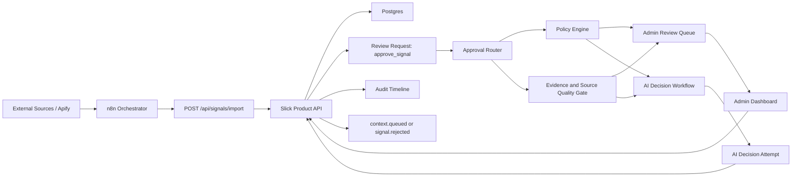

# Policy-Routed Signal Approval Architecture

Status: architecture proposal, documentation only.

## Purpose

Slick currently routes imported, source-backed signals into a human review queue:
n8n collects and normalizes evidence, the Product API imports signals, creates an
`approve_signal` review request, applies policy guards on decision, writes audit
events, and moves approved signals into `context.queued`.

This proposal evolves that model into policy-routed signal approval: each source-backed
signal can be approved or rejected by Admin or by AI, but only according to editable
admin policies. The Product API remains the authoritative boundary. n8n and AI may
prepare work, score evidence, and submit decision attempts, but the API decides whether
the attempt is allowed and records the final state transition.

The central safety rule is:

> AI can decide only when policy explicitly allows AI decisions for that agency,
> campaign, signal rule, source type, and decision type, and only when evidence and
> source quality thresholds pass. If any required policy, evidence, source quality,
> idempotency, status, or confidence condition fails, the signal is escalated to Admin.

## Design Goals

- Keep the Slick REST API as the Product API and system of record.
- Preserve the existing n8n orchestration contract: no direct Postgres writes from n8n.
- Make approval routing admin-editable without changing application code for each
  threshold adjustment.
- Support both approve and reject decisions, with different thresholds and blast radius.
- Treat scraped/source content as evidence, never instructions.
- Make every AI decision explainable, reproducible enough for audit, and reversible by
  Admin override.
- Keep idempotency and optimistic status transitions strong enough for retries and
  n8n replays.
- Prefer escalation over automation when evidence is ambiguous, weak, stale, conflicting,
  or policy coverage is missing.

## Existing Concepts To Reuse

Slick already has the right ownership boundaries:

| Concept | Existing shape | Proposed extension |
| --- | --- | --- |
| Product API boundary | REST API owns validation, status transitions, approvals, audit, idempotency, and Postgres access. | Add a policy-routed decision endpoint/use case that accepts AI/admin decision attempts but still owns final transitions. |
| n8n orchestration | n8n imports signals, polls queues, calls providers, and calls Slick API only. | n8n may run evidence scoring and AI decision workflows, then call Product API with a decision attempt. |
| Policy engine | `src/server/modules/policies` evaluates guarded decisions such as `signal.approve` and `signal.reject`. | Add routing and AI eligibility policies using the same `PolicySet` pattern, backed later by DB-loaded admin policy versions. |
| Review requests | `review_requests` represent pending approvals such as `approve_signal`; decisions are recorded in `review_decisions`. | Keep review requests as the shared decision object for Admin and AI. Add route ownership, escalation reason, and AI attempt records. |
| Audit | `audit_events` capture import, status changes, review decisions, and policy audit metadata. | Add audit events for routing, AI eligibility, AI attempted decision, AI allowed/denied, escalation, override, and policy version changes. |
| Idempotency | Mutating API calls use `Idempotency-Key`; signal import and signal decisions already replay safely. | Require deterministic idempotency keys for AI attempts and route decisions, keyed by signal, review request, policy version, evidence fingerprint, and decision model version. |
| Source quality | Admin operating model already reserves source quality metrics and blocked/weak/usable/trusted bands. | Promote source quality to a policy input that gates whether AI may decide or must escalate. |

## Conceptual Architecture



The Approval Router is a Product API use case, not an n8n workflow decision. It
evaluates current state, review request state, source quality, evidence quality,
tenant/campaign policy, and AI eligibility. n8n can trigger or host the AI workflow,
but cannot self-authorize an approval or rejection.

## Decision Lifecycle

### 1. Import And Review Creation

1. n8n collects a candidate from Apify or another source.
2. n8n normalizes source metadata, evidence snippets, observed time, company/account
   fields, `dedupeKey`, `correlationId`, and an import `Idempotency-Key`.
3. n8n calls `POST /api/signals/import`.
4. Product API validates schema, dedupes, inserts `signal.detected`, transitions to
   `signal.triage_requested`, creates an `approve_signal` review request, and audits:
   `signal.imported`, `signal.status_changed`, and `review.requested`.
5. Product API computes or stores an evidence fingerprint and initial source quality
   summary for routing.

### 2. Route Evaluation

The Product API evaluates a route for the pending review request:

1. Load signal, review request, agency policy set, campaign settings, signal rule,
   source profile, recent source quality metrics, and prior decisions for the same
   dedupe/account/campaign envelope.
2. Evaluate hard guards:
   - signal status must be `signal.triage_requested`
   - review request status must be `pending`
   - source URL/evidence requirements must be met
   - suppression/disqualifier hard blocks must be respected
   - policy version must be active
3. Evaluate routing policy:
   - `admin_only`
   - `ai_may_approve`
   - `ai_may_reject`
   - `ai_may_approve_or_reject`
   - `shadow_ai_only`
4. Evaluate thresholds:
   - source quality band and numeric score
   - evidence confidence
   - evidence freshness
   - source count or corroboration
   - ICP match score
   - signal rule confidence
   - contradiction/risk flags
   - AI model confidence and calibrated reason codes, if an AI attempt exists
5. If the route is Admin, keep the review request in the Admin queue and record the
   escalation reason. If AI is eligible, enqueue or accept an AI decision attempt.

### 3. AI Decision Attempt

When policy allows an AI path, n8n may call an LLM provider with a Product-API-built
decision packet. That packet contains evidence and policy-readable facts, not raw
unbounded scraped pages.

The AI returns a structured recommendation:

```json
{
  "decision": "approved",
  "confidence": 0.94,
  "reasonCodes": ["source_trusted", "fresh_evidence", "icp_match_high"],
  "evidenceRefs": ["evidence.snippets[0]", "source.url"],
  "riskFlags": [],
  "model": "provider-model-version",
  "promptVersion": "signal-ai-decision-v1"
}
```

The Product API then evaluates the AI attempt against policy. The AI response is an
input to policy, not the final authority.

### 4. Final Decision Or Escalation

If the AI attempt passes all policy, evidence, source quality, confidence, status,
and idempotency checks, the Product API:

1. writes a review decision with actor type `ai` or `system_ai`
2. transitions approved signals through `signal.approved` to `context.queued`
3. transitions rejected signals to `signal.rejected`
4. appends policy audit metadata and AI decision audit metadata
5. closes the review request as `approved` or `rejected`

If any condition fails, the Product API does not partially apply the AI decision. It
records `approval.escalated_to_admin`, keeps or returns the review request to
`pending`, and exposes the reason in the Admin Dashboard.

### 5. Admin Decision And Override

Admins and reviewers keep the existing dashboard workflow. They may approve or reject
pending signals regardless of whether AI declined, timed out, or recommended a result,
provided normal role/capability and status policies allow the action.

Admin override is explicit when it changes an AI decision or resolves an AI escalation.
Override requires a reason code and optional note, and it is audited as a separate event
linked to the original AI attempt and policy version.

## Data Model Additions

These additions are proposed schema concepts, not implementation changes in this task.

### `policy_sets`

Stores admin-editable policy versions per agency.

| Field | Notes |
| --- | --- |
| `id`, `agency_id` | Tenant-scoped policy set identity. |
| `version` | Monotonic integer used in audit and idempotency. |
| `status` | `draft`, `active`, `archived`. Only one active set per agency. |
| `policy_json` | The existing `PolicySet` shape plus routing extensions. |
| `created_by_member_id`, `activated_by_member_id` | Admin provenance. |
| `created_at`, `activated_at`, `updated_at` | Policy lifecycle timestamps. |

### `signal_evidence_assessments`

Stores evidence/source quality facts used by policy.

| Field | Notes |
| --- | --- |
| `signal_id`, `agency_id` | Tenant-scoped signal reference. |
| `source_quality_score` | 0-100 score. Suggested bands: blocked 0-29, weak 30-59, usable 60-84, trusted 85-100. |
| `evidence_confidence_score` | Confidence that the evidence supports the signal claim. |
| `freshness_hours` | Age from `observedAt` or source capture time. |
| `source_count` | Number of independent sources or corroborating records. |
| `evidence_fingerprint` | Hash of normalized source URL, excerpts, capture time, and extracted facts. |
| `risk_flags_json` | Missing URL, stale source, contradictory evidence, source blocked, extraction drift, prompt injection risk. |
| `assessment_version` | Scoring algorithm/config version. |

### `approval_routes`

Stores the selected route for a review request.

| Field | Notes |
| --- | --- |
| `review_request_id`, `signal_id`, `agency_id` | Decision object references. |
| `route` | `admin`, `ai`, `shadow_ai`, `blocked`. |
| `decision_scope` | `approve`, `reject`, or `approve_or_reject`. |
| `route_reason_codes_json` | Policy/evidence reasons. |
| `policy_set_id`, `policy_set_version` | Version evaluated. |
| `evidence_fingerprint` | Binds route to the evidence evaluated. |
| `expires_at` | Optional route expiry so stale evidence must be re-evaluated. |

### `ai_signal_decision_attempts`

Stores every AI recommendation, including denied and shadow-only attempts.

| Field | Notes |
| --- | --- |
| `id`, `agency_id`, `signal_id`, `review_request_id` | Attempt identity. |
| `attempt_status` | `accepted`, `policy_denied`, `escalated`, `shadow_recorded`, `failed`. |
| `recommended_decision` | `approved`, `rejected`, or `abstain`. |
| `confidence_score` | Calibrated 0-1 value. |
| `reason_codes_json`, `risk_flags_json` | Structured explanation. |
| `evidence_refs_json` | References into stored evidence, not large copied source bodies. |
| `model_provider`, `model_name`, `model_version` | Provider metadata. |
| `prompt_version`, `decision_schema_version` | Reproducibility metadata. |
| `policy_set_id`, `policy_set_version` | Policy used to evaluate the attempt. |
| `evidence_fingerprint` | Prevents replaying a decision against changed evidence. |
| `idempotency_key`, `correlation_id` | Replay and traceability. |

### Review And Audit Extensions

`review_requests` should gain optional routing fields:

- `route_owner`: `admin`, `ai`, `shadow_ai`
- `escalation_reason_code`
- `last_ai_attempt_id`
- `policy_set_id`
- `policy_set_version`

`review_decisions` should gain actor flexibility:

- `decided_by_actor_type`: `member`, `ai`, `system`
- `decided_by_actor_id`
- `ai_attempt_id`
- `override_of_decision_id`
- `override_reason_code`

`audit_events` should include or consistently carry:

- `correlationId`
- `idempotencyKey`
- `policySetId`
- `policySetVersion`
- `evidenceFingerprint`
- `aiAttemptId`

## Policy Model

The existing `PolicySet` model can be extended rather than replaced. Current decision
IDs `signal.approve` and `signal.reject` remain final action guards. Policy-routed
approval adds routing and AI eligibility policies that run before those final guards.

### Proposed Decision IDs

| Decision | Purpose |
| --- | --- |
| `signal.route_approval` | Select Admin, AI, shadow AI, or blocked route for a pending signal review. |
| `signal.ai_approve` | Allow AI to approve a signal when all evidence/source thresholds pass. |
| `signal.ai_reject` | Allow AI to reject a signal when low-quality or disqualifying evidence is clear. |
| `signal.escalate_to_admin` | Record why a signal must stay with Admin. |
| `policy.manage_approval_routing` | Allow owners/admins to edit and activate routing policies. |

### Admin-Editable Thresholds

Policy editing should expose domain-safe controls instead of raw JSON first:

| Threshold | Typical control |
| --- | --- |
| AI routing mode | Off, shadow only, reject only, approve only, approve and reject. |
| Minimum source quality for AI approve | Numeric threshold, default 85. |
| Minimum evidence confidence for AI approve | Numeric threshold, default 0.90. |
| Minimum AI confidence for approve | Numeric threshold, default 0.92. |
| Maximum freshness age | Hours/days, by source type. |
| Minimum ICP match score | Numeric threshold, default 80. |
| Minimum corroborating sources | Integer, default 1 for trusted source, 2 for weaker sources. |
| Low-quality auto-reject threshold | Numeric threshold, conservative and source-specific. |
| Blocked source types/domains | Admin-maintained allow/block list. |
| Campaign/signal-rule scope | Include/exclude specific campaigns and signal rules. |
| Daily AI decision cap | Blast-radius control per agency/campaign. |
| Sampling rate for human audit | Percentage of AI decisions sent to Admin QA after decision. |

Every activated policy version should be immutable. Editing creates a draft version;
activation requires an owner/admin capability and writes a `policy.version_activated`
audit event.

### Example Policy Shape

```json
{
  "id": "agency-policy-set",
  "version": 7,
  "policies": [
    {
      "id": "signal.ai_approve.high_confidence_apify",
      "decision": "signal.ai_approve",
      "description": "AI may approve trusted Apify job-posting signals for selected campaigns.",
      "requiredCapability": "signals.ai_decide",
      "constraints": [
        {
          "code": "signal.status_triage_requested",
          "path": "status",
          "operator": "equals",
          "value": "signal.triage_requested",
          "reason": "Signal is not waiting for triage."
        },
        {
          "code": "source.quality_trusted",
          "path": "sourceQuality.score",
          "operator": "gte",
          "value": 85,
          "reason": "Source quality is below the AI approval threshold."
        },
        {
          "code": "evidence.confidence_high",
          "path": "evidence.confidenceScore",
          "operator": "gte",
          "value": 0.9,
          "reason": "Evidence does not strongly support the signal."
        },
        {
          "code": "ai.confidence_high",
          "path": "ai.confidenceScore",
          "operator": "gte",
          "value": 0.92,
          "reason": "AI confidence is below the approval threshold."
        }
      ]
    }
  ]
}
```

## AI Decision Constraints

AI is constrained by design:

- AI cannot decide unless policy explicitly enables the relevant route and decision.
- AI cannot override hard Product API guards, role/capability checks, status transitions,
  suppression rules, tenant/campaign pause state, or idempotency.
- AI cannot decide on missing, stale, inaccessible, blocked, or contradictory evidence.
- AI cannot use scraped content as instructions. Evidence must be delimited and treated
  as untrusted input.
- AI must return structured JSON matching a versioned schema. Free-text decisions are
  recommendations only and should be escalated.
- AI must cite stored evidence references for every approve/reject reason.
- AI must abstain when the policy packet is incomplete or the signal does not fit the
  configured decision scope.
- AI approve thresholds should be stricter than AI reject thresholds because approving
  advances work into downstream context and draft generation.
- AI rejection should initially be limited to clear non-fit, duplicate, stale, blocked
  source, or source-quality failure cases. Ambiguous market relevance should go to Admin.
- AI decisions should be rate-limited and sampled for Admin QA, especially during rollout.

## Admin Override Model

Admin remains the final accountable operator.

Admin can:

- approve or reject any pending signal that policy allows a reviewer to decide
- take over an AI-routed pending review
- override an AI decision if the downstream state still permits reversal or if a
  compensating workflow is available
- mark an AI decision as correct/incorrect for later evaluation
- adjust policy thresholds through the approved policy management flow

Override requirements:

- require `signals.review` plus an override-specific capability for reversing completed
  AI decisions
- require an override reason code such as `evidence_misread`, `source_wrong`,
  `policy_too_loose`, `customer_context`, `duplicate_not_detected`
- create a linked `review_decision` rather than mutating the original decision
- write audit events for `review.override_requested`, `review.override_applied`, and
  any resulting status changes
- never silently edit policy thresholds to justify a past decision

## Audit And Observability

Every signal detail view should be able to show a full timeline:

- signal import and dedupe outcome
- source/evidence assessment version and score
- review request creation
- approval route selected
- policy allow/deny evaluations
- AI attempt submitted, accepted, denied, failed, or shadow-recorded
- final review decision
- Admin override or QA marking
- status transitions
- downstream context queue entry

Recommended audit event names:

- `approval.route_evaluated`
- `approval.escalated_to_admin`
- `ai.signal_decision_attempted`
- `ai.signal_decision_policy_allowed`
- `ai.signal_decision_policy_denied`
- `ai.signal_decision_shadow_recorded`
- `review.ai_approved`
- `review.ai_rejected`
- `review.admin_override_applied`
- `policy.version_created`
- `policy.version_activated`

Metrics:

- AI eligibility rate by campaign/source/rule
- AI approval and rejection counts
- escalation count by reason code
- source quality distribution and trend
- policy deny count by policy reason
- AI confidence distribution by final outcome
- Admin override rate
- QA sample disagreement rate
- time saved versus Admin-only baseline
- oldest pending review age
- idempotent replay count for AI attempts
- downstream failure rate for AI-approved signals

Alerts:

- source quality score drops below threshold
- AI override/disagreement rate exceeds threshold
- AI decision volume exceeds policy cap
- policy deny spike after policy activation
- AI provider unavailable or schema-invalid responses rise
- stale evidence route expiry breaches

## Failure Modes

| Failure | Behavior |
| --- | --- |
| AI provider timeout | Keep review pending, record attempt failure, escalate to Admin after retry budget. |
| AI returns invalid JSON | Reject attempt as schema invalid, audit, escalate to Admin. |
| Policy service/load failure | Fail closed to Admin route. Do not allow AI decisions without an active policy version. |
| Source quality missing | Escalate to Admin unless policy explicitly allows shadow-only assessment. |
| Evidence changed after route | Recompute route; reject stale AI attempt when evidence fingerprint differs. |
| Duplicate AI attempt | Return idempotent replay when key/body match; conflict when same key has different semantic body. |
| Signal status changed concurrently | Reject attempt with conflict and audit policy/status denial. |
| n8n replay after Admin decision | Return already processed or conflict based on final status; do not reopen review silently. |
| Model confidence below threshold | Escalate to Admin with `ai_confidence_below_threshold`. |
| Contradictory evidence | Escalate to Admin with visible risk flag. |
| Source blocked by policy | Reject AI approval path; optionally allow AI reject only if configured. |
| Policy edited mid-flight | Bind attempt to evaluated policy version; require re-evaluation for new version. |

## API Implications

Current endpoints can remain in place:

- `POST /api/signals/import`
- `GET /api/signals`
- `POST /api/signals/{id}/approve`
- `POST /api/signals/{id}/reject`
- `GET /api/reviews`
- `POST /api/reviews/{id}/decision`
- `GET /api/context-queue`

Recommended additions:

| Endpoint | Purpose |
| --- | --- |
| `POST /api/reviews/{id}/route` | Evaluate or re-evaluate the approval route for a review request. |
| `POST /api/reviews/{id}/ai-decision-attempt` | Accept an AI structured decision attempt and apply it only if policy allows. |
| `POST /api/reviews/{id}/escalate` | Explicitly return an AI-routed item to Admin with reason. |
| `POST /api/reviews/{id}/override` | Admin override of AI decision or AI escalation. |
| `GET /api/policies/approval-routing` | Read active/draft approval routing policy. |
| `POST /api/policies/approval-routing/draft` | Create/update draft thresholds. |
| `POST /api/policies/approval-routing/activate` | Activate an immutable policy version. |
| `GET /api/automation/source-quality` | Existing operating-model aggregate, promoted for policy observability. |

Mutating AI endpoints require:

- `Authorization` for an automation or AI service actor
- `Idempotency-Key`
- `X-Correlation-Id`
- request body with `policySetId`, `policySetVersion`, `evidenceFingerprint`,
  `model`, `promptVersion`, structured decision, confidence, reason codes, and evidence refs

The Product API response should distinguish:

- `applied`: AI decision accepted and status changed
- `escalated`: AI decision not applied; Admin review required
- `shadowRecorded`: AI result stored but not applied
- `alreadyProcessed`: idempotent or final-state replay
- `policyDenied`: rejected by policy, with redacted reasons

## Idempotency And Concurrency

AI decision attempts need stronger idempotency keys than ordinary button clicks because
n8n, provider retries, and route re-evaluation can overlap.

Recommended key format:

```text
reviews.ai_decision:{reviewRequestId}:{policySetVersion}:{evidenceFingerprint}:{modelVersion}:{attemptOrdinal}
```

Rules:

- Reusing the same key with the same semantic body returns the stored result.
- Reusing the same key with a different decision, model version, policy version, or
  evidence fingerprint returns conflict.
- AI attempts are valid only while the review request is `pending` and the signal is
  `signal.triage_requested`.
- The API should use row version checks or transactional status predicates when closing
  review requests and transitioning signals.
- Policy route records should expire when evidence becomes stale or policy changes.

## Implementation Phases

### Phase 0: Baseline Documentation And Metrics

- Keep Admin-only signal approval behavior.
- Add documentation and dashboard labels for policy-routed approval concepts.
- Ensure audit timelines expose correlation ID, review request ID, and policy audit
  metadata for existing signal decisions.

### Phase 1: Evidence And Source Quality Gate

- Add evidence assessment data model and source quality scoring.
- Compute source quality on import or shortly after import.
- Show source quality and risk flags in Admin signal review.
- Keep all decisions Admin-owned.

### Phase 2: Admin-Editable Routing Policies

- Persist agency policy sets and immutable versions.
- Add admin UI for thresholds, scopes, activation, and audit history.
- Add Product API route evaluation that always returns Admin route initially.
- Add policy deny/escalation observability.

### Phase 3: Shadow AI

- Let n8n run AI decision attempts for eligible signals.
- Store AI recommendations and compare them with Admin decisions.
- Do not apply AI decisions.
- Track disagreement, confidence calibration, source quality correlation, and override
  risk before enabling automation.

### Phase 4: AI Auto-Reject For Clear Non-Fit

- Enable AI rejection only for tightly scoped, low-risk reasons such as blocked source,
  duplicate, stale evidence, or explicit ICP disqualifier.
- Require source/evidence thresholds and Admin-configured caps.
- Sample rejected signals for Admin QA.

### Phase 5: AI Auto-Approve For High-Confidence Signals

- Enable AI approvals for trusted sources, high evidence confidence, high ICP match,
  selected campaigns, and low downstream risk.
- Keep daily caps, QA sampling, fast rollback to Admin-only, and per-source/campaign
  observability.

### Phase 6: Optimization And Learning

- Use Admin overrides and QA samples to tune thresholds.
- Add policy simulation before activation.
- Add campaign-specific calibration reports.
- Consider adaptive thresholds only after enough audited outcomes exist.

## Trade-Offs

| Choice | Benefit | Cost |
| --- | --- | --- |
| Product API owns routing | Strong consistency, audit, idempotency, and policy enforcement. | More API surface and domain logic in backend. |
| Admin-editable policy versions | Operators can tune thresholds without deploys. | Requires policy validation, simulation, activation flow, and rollback. |
| Fail closed to Admin | Protects customers when evidence/policy/AI is uncertain. | Less automation during outages or early rollout. |
| Store AI attempts separately | Preserves explainability and shadow-mode evaluation. | More schema and observability work. |
| Strict evidence fingerprints | Prevents stale AI decisions. | Requires normalized evidence hashing and route re-evaluation. |
| Separate AI approve and reject policies | Allows conservative rollout by decision type. | More policy complexity for admins. |
| QA sampling of AI decisions | Catches drift and calibration issues. | Keeps some human workload even after automation. |

## Open Design Questions

- Should AI actors be represented as `automation` users, a new `ai` actor type, or both
  depending on whether n8n or the Product API invokes the model?
- Should source quality be computed synchronously during import or asynchronously before
  route evaluation?
- What reversal semantics are acceptable once an AI-approved signal has already generated
  context or drafts?
- How much of the policy editor should be structured controls versus advanced JSON?
- Which sources qualify for the first trusted allowlist?

## Recommended Initial Defaults

- AI routing mode: `shadow_ai_only`
- AI approve: disabled
- AI reject: disabled except shadow recommendations
- Minimum source quality for future AI approve: 85
- Minimum evidence confidence for future AI approve: 0.90
- Minimum AI confidence for future AI approve: 0.92
- Maximum evidence age: 7 days for job/source-page signals, source-specific later
- Admin QA sample rate for first live AI decisions: 20-50 percent
- Daily AI decision cap: low per campaign until override/disagreement rate is stable

These defaults keep the MVP's Admin-first operating model intact while creating a
clear, auditable path toward controlled AI decisions.
